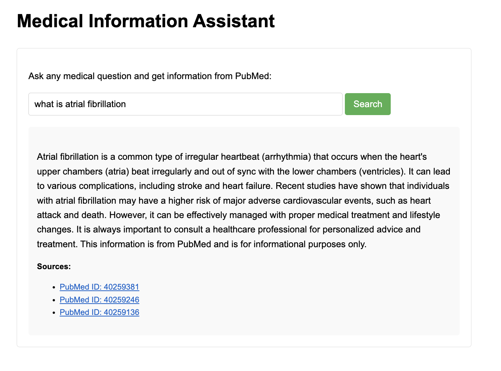

# Medical Information Assistant

A Flask-based web application that uses Retrieval-Augmented Generation (RAG) with OpenAI and PubMed data to answer medical questions.
Users can ask any medical question and receive up-to-date, referenced information from PubMed articles, powered by large language models.

## How it Works
User Query:
A user submits a medical question through the web interface.

Document Retrieval (RAG):
The system searches PubMed—a leading medical literature database—for the most relevant and recent articles related to the question. It fetches and parses these articles, extracting titles, abstracts, authors, and publication details.

Knowledge Indexing:
Retrieved PubMed articles are converted into vector embeddings using OpenAI’s embedding models and indexed using LlamaIndex for fast semantic search.

Contextual Generation with LangChain:
- It combines the retrieved PubMed information with the user’s question.
- It feeds this context into an OpenAI language model (LLM) via a prompt template.
- The LLM generates a clear, referenced answer, citing the PubMed articles used.

Response Display:
The user receives an answer, along with clickable PubMed source links for transparency and further reading.

## Demo


1. Clone the repository
```bash
git clone <repository-url>
cd medical_rag_system
```

2. Set Up API Keys and Configuration in config.py
```bash
OPENAI_API_KEY=your_openai_api_key (get from OpenAI dashboard)
PUBMED_EMAIL=your_email@example.com (for PubMed E-utilities, recommended for higher rate limits)
```
3. Install Dependencies and activate a virtual environment (recommended)
```bash
python -m venv venv
source venv/bin/activate  # On Windows: venv\Scripts\activate
pip install -r requirements.txt
```

4. Run the Application
```bash
python app.py
```
The app will be available at http://localhost:5000.

## Usage
- Enter your medical question in the search box and click "Search".
- The assistant will retrieve relevant PubMed articles and generate an answer.
- Sources are listed below each answer with direct links to PubMed.

## API Endpoints
- POST /ask — Ask a medical question (JSON: { "question": "..." })
- GET /api/medical-data/pubmed/search?q=... — Search PubMed for articles.
- GET /api/medical-data/pubmed/article/<article_id> — Get full details for an article.
- POST /api/medical-data/update-index — Update the RAG index with new PubMed data.

## Technical Stack
- Backend: Python, Flask
- AI/GenAI: OpenAI GPT models, LlamaIndex, LangChain
- Retrieval: PubMed E-utilities API (NCBI)
- Frontend: React (built and served as static files via Flask)
- Deployment: Easily run locally or on any cloud platform
